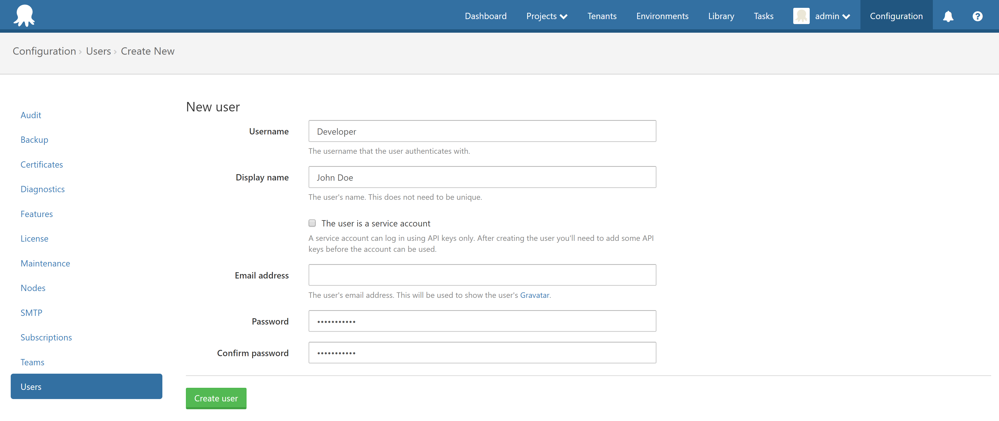
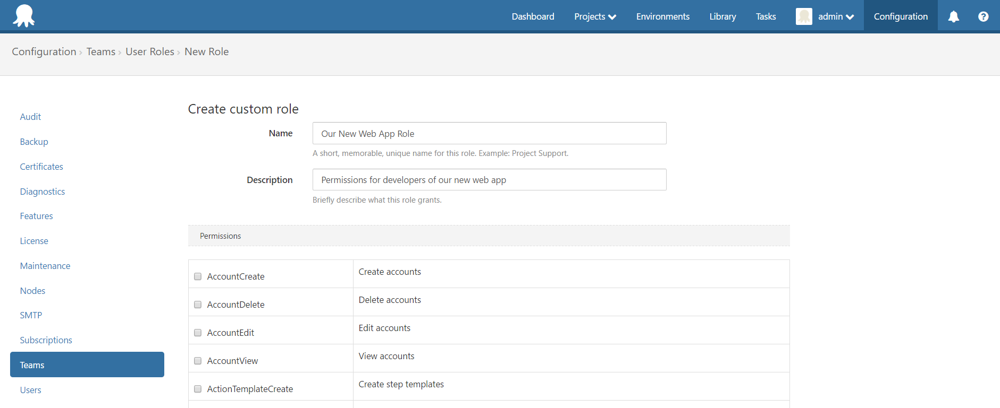
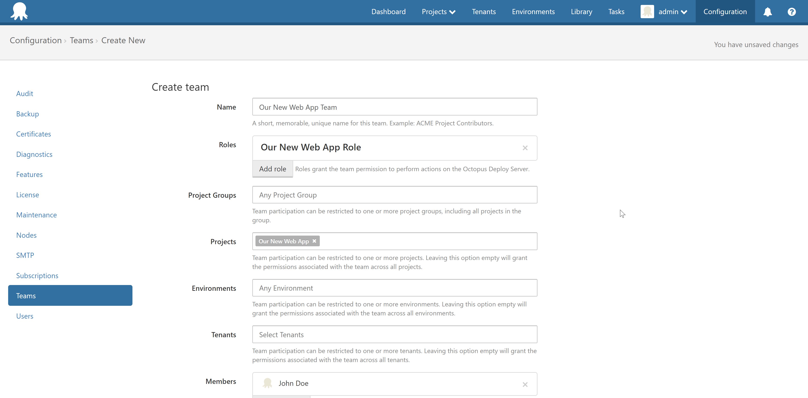
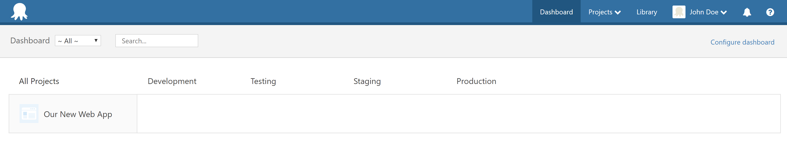
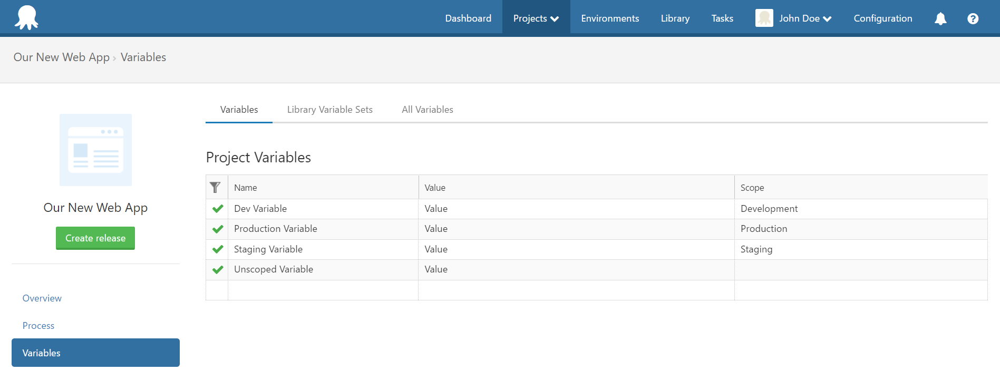
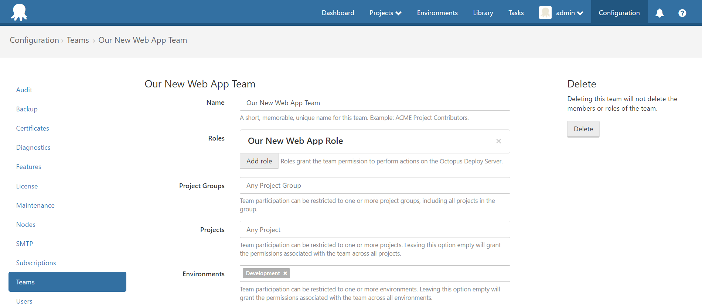

This page is designed to be an introduction to using permissions with Octopus, and how permissions, roles and teams work together in allowing users access to appropriate information. It's commonly a little confusing at first as the control you have is so granular, but the concept can be simplified to this.

- Permissions are given to a role
- A role is assigned to a team
- Users belong to the team
- A team is scoped to projects, project groups and/or environments

### Example Scenario

We have a team that should be dedicated to a specific project. They should be able to create and edit anything to do with this project (i.e. deployment process, variables, channels, etc.). To accomplish this, we'll follow these steps.

1. Create a user.
2. Create a custom role and assign it specific permissions.
3. Create a new team, scope it to a specific project, and assign this new role and user to it.

### Process

1. First, we'll create a new user in *Configuration > Users* page in the web portal.

2. We'll then create a custom role and giving it the following permissions. This will by default give access to all projects. We'll scope the team to our single project in the next step.

This is the list of permissions we will assign to this role.

- EnvironmentView

- ProcessEdit

- ProcessView

- ProjectEdit

- ProjectView

- ReleaseCreate

- ReleaseDelete

- ReleaseEdit

- ReleaseView

- TriggerEdit

- TriggerView

- VariableEdit

- VariableEditUnscoped

- VariableView

- VariableViewUnscoped

:::hint
This can be simplified by using the following [built-in user roles](https://octopus.com/docs/administration/managing-users-and-teams/user-roles).

Project Deployer - All project contributor permissions, plus: deploying releases, but not creating them.

Project Lead - All project contributor permissions, plus: creating releases, but not deploying them.
:::

3. Now let's create a new team to assign our role and user to. We'll give it the same name as the project these users will have access to. We'll also scope our team to a specific project.

Now let's look at the results from this new user's perspective. You'll see that they can view all of the environments, but they can only see the specific project.

Looking at the project variables, they are able to view and edit variables scoped to any environment, including unscoped variables.

Additionally, you can limit view and edit permissions for this user by scoping their team to one or more environments. The user will then only be permissed to access variables scoped to those defined environments.

Jump back in to the project variables screen with this user to see this change in action. Notice now that this user can *only* access unscoped variables and variables scoped to the Development environment.

:::hint
VariableViewUnscoped and VariableEditUnscoped lie outside of the team's environment scoping. To restrict access to unscoped variables, remove these specific permissions.
:::

I hope this provides some good insight as to how permissions, roles and teams work together. Considering the other scoping options available which we haven't used, you can see the potential of how granular you can get when defining permissions for your users.
