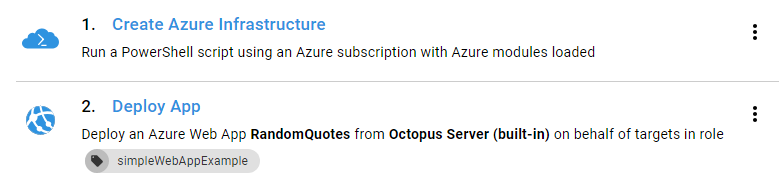
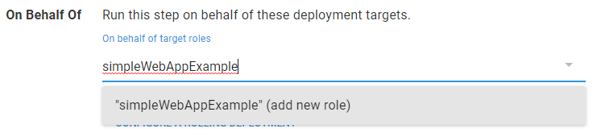
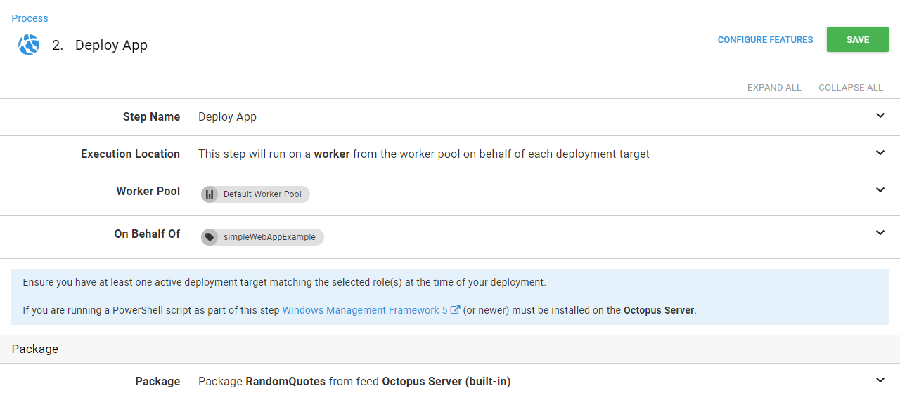

This guide will show the basics to be able to deploy applications to dynamic Azure infrastructure using Octopus Deploy.

We will also get the user to provide the site name when the deployment occurs.

This is the deployment process we are going to build in this guide. The end result will be:
 - A new Azure Web App
 - A new Octopus Deployment Target
 - An application deployed to the Web App




## Step 1: Create a prompted variable

Under the **Variables** section in the project, create a new [Prompted Variable](/docs/deployment-process/variables/prompted-variables.md) called *SiteName*.

## Step 2: Create the target infrastructure

The first step we need is an **Azure PowerShell Script**.


In the step configuration, add the following code:

```powershelll
# create a new Azure Web App
# The resource group and App Service Plan were created ahead of time

New-AzureRmWebApp -Name $SiteName `
                  -Location "WestUS" `
                  -AppServicePlan "OctoSimpleExampleAppPlan" `
                  -ResourceGroupName "OctopusSimpleWebAppDynamicInfrastructureExample"

New-OctopusAzureWebAppTarget -name $SiteName `
                             -azureWebApp $SiteName `
                             -azureResourceGroupName "OctopusSimpleWebAppDynamicInfrastructureExample"  `
                             -octopusAccountIdOrName "azure" `
                             -octopusRoles "simpleWebAppExample" `
                             -updateIfExisting
```


:::info
Notes about the above script:

- the `-octopusAccountIdOrName` parameter is the account that will be used to connect to the Azure Web App for deployments, here I am just using the account named `azure`
- the `-octopusRoles` paramater is a comma seperated list of [Roles](/docs/infrastructure/target-roles/index.md) that will be assigned to the target after it is created. This will be used in the next step to select the target(s) to have the application deployed to.
- `$SiteName` refers to the variable created in step 1.
- the `-updateIfExisting` parameter will update an existing target with the values provided if it matches on name. This allows your processes to be repeatable.

:::

## Step 3: Deploy the Application

The next step in this example is to add a **Deploy an Azure Web App** step.


In this step, you need to set the role that the step will run on behalf of to the role we set in the first step, `simpleWebAppExample`. This role will not be in the list because it doesn't actually exist, so you just need to type the value and select `simpleWebAppExample (add new role)` from below the field.



You will also need to select the package to deploy in the **Package** section.



## Exercises for the reader

To keep the guide simple, a few things were simplified.

- The script expected the **Resource Group** and **Application Service Plan** to already be provisioned. These can be provisioned at execution time using the `New-AzureRmResourceGroup` and `New-AzureRmAppServicePlan` PowerShell cmdlets. All of these **Azure** operations can also be achieved with the **Azure CLI**.
- The **Site Name** parameter can have clashes with other web applications in **Azure** as they are required to be unique.
- Deploying a new version of the Application would end up provisioning a new site, by adding a **Run Condition** to the **SiteName** prompted variable, the provision step will only execute if a value has been provided. Setting the **Run Condition** to `#{SiteName}` will achieve this.